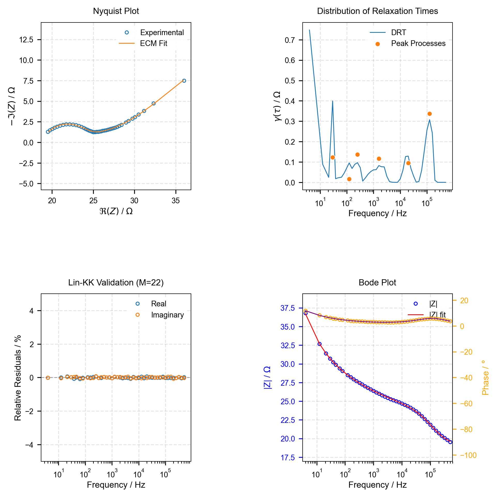

# Impedance Analysis Tool

A Python package for automated impedance spectroscopy analysis.

The package leverages advanced numerical optimization techniques through JAX/JAXopt for robust fitting procedures, while incorporating AI-powered interpretation to provide insights about the underlying physical and electrochemical processes. Whether you're analyzing fuel cells, batteries, corrosion systems, or any other electrochemical interface, this tool offers a powerful and user-friendly approach to impedance analysis.

## Key Benefits

- Automated workflows that reduce analysis time from hours to minutes
- Robust numerical methods for reliable parameter extraction
- AI-assisted interpretation for deeper insights into your systems
- Comprehensive validation through Lin-KK testing
- Flexible output formats for easy integration with other tools
- Publication-ready visualizations

## Features

- **Distribution of Relaxation Times (DRT) Analysis**
- **Equivalent Circuit Model (ECM) Fitting**
- **Lin-KK Data Validation**
- **AI-Assisted Interpretation of Results**
- **Multiple Output Formats**: JSON, CSV, Excel
- **Configurable Logging and Debug Modes**

## Installation

```bash
# Create and activate virtual environment
python -m venv venv
source venv/bin/activate  # Linux/Mac
# or
.env\Scriptsctivate  # Windows

# Install package
pip install -e .

# Setup environment variables
cp impedance_agent/.env.example .env
# Edit .env with your API keys
```

## Usage

### Basic Usage

#### If Package is Installed

```bash
impedance-agent analyze data/impedance.txt
```

#### With ECM Fitting

```bash
impedance-agent analyze data/impedance.txt --ecm configs/models/randles.yaml
```

#### If Using Repository Directly

```bash
python -m impedance_agent.src.cli.main data/impedance.txt
```

#### With ECM Fitting

```bash
python -m impedance_agent.src.cli.main data/impedance.txt --ecm configs/models/randles.yaml
```

### Full Options

```bash
python -m impedance_agent.cli.main \
  examples/data/impedance.txt \
  --ecm examples/models/randles.yaml \
  --output-path results/analysis.json \
  --output-format json \
  --plot-format png \
  --plot \
  --log-level DEBUG \
  --debug
```

### Command Line Options

- `data_path`: Path to impedance data file (required)
- `--ecm`: Path to the equivalent circuit model (ECM) configuration file
- `--output-path`: Path for saving results
- `--output-format`: Output format (json/csv/excel)
- `--plot-format`: Plot format (png/pdf/svg)
- `--plot`: Generate plots (default: True)
- `--show-plots`: Display plots in window (default: False)
- `--log-level`: Logging level (DEBUG/INFO/WARNING/ERROR)
- `--debug`: Enable debug mode (default: False)
- `--workers`: Number of worker processes (default: auto-detected)

### Additional Commands

- `list_providers`: List available LLM providers.
- `version`: Show the version of the impedance agent.

## Input Data Format

Supports CSV/TXT files with the following columns:

- `frequency` (Hz)
- `Z_real` (Ω)
- `Z_imag` (Ω)

## Model Configuration

YAML format for ECM definition:

```yaml
model_code: |
  def impedance_model(p, f):
    w = 2 * jnp.pi * f
    Rs, Rct, Cdl = p
    Z = Rs + Rct / (1 + 1j * w * Cdl * Rct)
    return jnp.concatenate([Z.real, Z.imag])

variables:
  - name: Rs
    initialValue: 0.1
    lowerBound: 1e-6
    upperBound: 1000.0
  - name: Rct
    initialValue: 1.0
    lowerBound: 1e-6
    upperBound: 1e6
  - name: Cdl
    initialValue: 1e-6
    lowerBound: 1e-12
    upperBound: 1e-3
```

## Example Output

### Visualization



The tool generates publication-ready plots including:
- Nyquist Plot with ECM fit
- Distribution of Relaxation Times (DRT)
- Lin-KK Validation
- Bode Plot
- Analysis Summary (shown below)

### Analysis Summary

#### Comprehensive Analysis of Impedance Data

**1. Path Following Analysis (ECM Fit)**
   - **Path Deviation**: 0.0587 (5.87% deviation)
   - **Rating**: Acceptable
   - **Implications**:
     - The model follows the experimental arc shape reasonably well.
     - The deviation is within the acceptable range (< 0.10), indicating the model structure is valid.
     - No immediate need to modify the model structure, but further refinement is possible.

**2. Vector Difference Analysis (ECM Fit)**
   - **Vector Difference**: 0.00155 (0.155% average deviation)
   - **Rating**: Excellent
   - **Implications**:
     - The fit closely matches the experimental data in both real and imaginary components.
     - The residuals are minimal, indicating a high-quality fit.

**3. Parameter Correlation Analysis**
   - **Strong Correlations**:
     - **Qh-nh**: Expected strong correlation (|r| = 0.986), typical for CPE parameters.
     - **Wad-Cad**: Strong correlation (|r| = 0.999), expected for diffusion-related parameters.
     - **Rint-Wint**: Strong correlation (|r| = 0.993), indicating a physical relationship between interfacial resistance and diffusion.
   - **Other Correlations**:
     - **Rs-Rp**: Strong correlation (|r| = 0.978), suggesting a possible overparameterization or redundant elements.
     - **Rad-Rint**: Moderate correlation (|r| = 0.151), no significant overparameterization.
   - **Implications**:
     - The strong Qh-nh and Wad-Cad correlations are expected and do not indicate overparameterization.
     - The Rs-Rp correlation suggests potential redundancy in the model. Consider simplifying the model by fixing or removing one of these parameters.

**4. DRT Analysis**
   - **Peak Frequencies**: 29.5 Hz, 123 Hz, 250 Hz, 1.58 kHz, 19.9 kHz, 125.6 kHz
   - **Peak Polarizations**: 0.123, 0.016, 0.137, 0.117, 0.095, 0.336
   - **Implications**:
     - The DRT reveals six distinct processes with characteristic time constants.
     - The highest polarization (0.336) at 125.6 kHz suggests a dominant high-frequency process, likely related to charge transfer or interfacial phenomena.
     - The lower-frequency peaks (29.5 Hz, 123 Hz, 250 Hz) may correspond to diffusion or bulk processes.
     - The DRT results align well with the ECM fit, validating the model structure.

**5. Lin-KK Analysis**
   - **Validation Metrics**:
     - **M**: 22
     - **μ**: 0.611
     - **Max Residual**: 0.00112
     - **Mean Residual**: 0.000456
   - **Implications**:
     - The data satisfies the Kramers-Kronig relations, indicating high-quality measurements.
     - The residuals are minimal, confirming the validity of the experimental data.

**6. ECM Fit Metrics**
   - **Chi-Square**: 0.000133
   - **AIC**: -346.52
   - **WRMS**: 1.68e-06
   - **Implications**:
     - The low chi-square and AIC values indicate a high-quality fit.
     - The weighted root mean square (WRMS) is exceptionally low, further confirming the fit's accuracy.

**7. Residual Analysis**
   - **Real Residuals**: Range from -0.00069 to 0.00076
   - **Imaginary Residuals**: Range from -0.00042 to 0.00086
   - **Implications**:
     - Residuals are randomly distributed around zero, indicating no systematic errors.
     - The residuals are within acceptable limits, confirming the fit's reliability.

## Key Recommendations

### For ECM Fit
1. **Model Refinement**:
   - Consider simplifying the model by addressing the strong Rs-Rp correlation. Fixing one of these parameters may improve parameter identifiability.
   - Validate the physical meaning of the parameters, especially Rad, Wad, and Rint, to ensure they align with the system's electrochemical processes.

2. **Parameter Optimization**:
   - Re-optimize the model with tighter bounds or fixed parameters to reduce uncertainties, especially for Rad and Rint, which have large errors.

3. **Physical Interpretation**:
   - Use the DRT peaks to assign physical processes to the ECM elements. For example:
     - High-frequency peaks (125.6 kHz) may correspond to charge transfer resistance.
     - Mid-frequency peaks (1.58 kHz, 19.9 kHz) may relate to diffusion or interfacial processes.
     - Low-frequency peaks (29.5 Hz, 123 Hz, 250 Hz) may represent bulk or electrode processes.

### For Data Quality
- The data is of high quality, as confirmed by Lin-KK validation and low residuals.
- No significant measurement artifacts or system limitations were detected.

### For Further Investigation
- Perform additional experiments at lower frequencies to better characterize the low-frequency processes.
- Explore alternative model structures if further refinement is needed.

---

## Requirements

- Python 3.9+
- JAX/JAXopt
- NumPy/SciPy
- Pydantic
- OpenAI API Access
- `impedance.py`

## Contributing

Contributions are welcome! Please feel free to submit a Pull Request. For major changes, please open an issue first to discuss what you would like to change.

## Citation

If you use this tool in your research, please cite:

```bibtex
@software{impedance_agent,
  author = {Chukwu, Richard},
  title = {Impedance-Agent: AI-powered EIS Analysis Tool},
  year = {2024},
  url = {https://github.com/richinex/impedance-agent}
}
```

## Support the Project

If you find this tool useful, consider buying me a coffee:

[](https://www.buymeacoffee.com/richinex)

## Documentation

For detailed documentation, see the [docs](https://richinex.github.io/impedance-agent/)

## Acknowledgments

This project uses several open-source packages including:

- JAX/JAXopt for optimization
- `impedance.py` for impedance analysis
- OpenAI / DeepSeek API for AI-assisted interpretation

## License

This project is licensed under the MIT License.

Made with ❤️ by Richard Chukwu